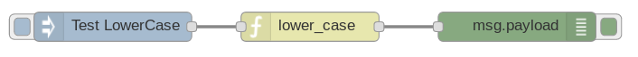

=========
pynodered
=========

.. image:: https://img.shields.io/pypi/v/pynodered.svg
        :target: https://pypi.python.org/pypi/pynodered

.. image:: https://img.shields.io/travis/ghislainp/pynodered.svg
        :target: https://travis-ci.org/ghislainp/pynodered

.. image:: https://readthedocs.org/projects/pynodered/badge/?version=latest
        :target: https://pynodered.readthedocs.io/en/latest/?badge=latest
        :alt: Documentation Status

About
--------

Make your python functions available in Node-RED using a simple decorator.

pynodered is a server communicating with Node-RED to make available your python functions as blocks in Node-RED. pynodered reads modules and python files containing functions decorated with 'node_red', register them as blocks in Node-RED. pynodred then handles communications between Node-RED (in javascript) to run your function whenever the block receives a message.

Quick Start
------------

Requires python>=3.5

.. code-block:: console

    $ pip install pynodered

Examples
------------

A simple example to lowercase the payload of the messages:

.. code-block:: python

    from pynodered import node_red

    @node_red(category="pyfuncs")
    def lower_case(node, msg):

        msg['payload'] = str(msg['payload']).lower()
        return msg

Put this snippet is in a file "example.py", run the pynodered server with:

.. code-block:: console

    $ pynodered example.py

and in another console:

.. code-block:: console

    $ node-red

In Node-RED, you now have a new category "pyfuncs" with a function lower_case. It can be used in a flow as any other blocks:

It is possible to add block properties (constant arguments provided by the user in Node-RED) by defining a property in the decorator:

.. code-block:: python

    from pynodered import node_red, NodeProperty

    @node_red(category="pyfuncs",
              properties=dict(number=NodeProperty("Number", value="1")))
    
    def repeat(node, msg):

        msg['payload'] = msg['payload'] * int(node.number.value)
        return msg

Don't forget to restart the pynodered server everytime your python files change. Node-RED also needs to be restarted but only when the function name or properties change or a new function is added. Refreshing the browser is then necessary.

By default pynodered exports the functions in the Node-RED package 'pynodered' and the category 'default'. The category name can be changed with the decorator optional argument. For the package name and information, the python module containing the functions can declare a 'package' dictonary like this:

.. code-block:: python

    package = {
        "name" : "FFT filters",
        "version" : "0.01",
        "description"  : "Nodes written in Python for signal processing",
    }

License
----------

Copyright (C) 2019 Ghislain Picard

Free software: GNU General Public License v3

This package is a rewrite and extension of the code intially written by Tomaž Šolc for sigfox-toolbox
https://github.com/sensorlab/sigfox-toolbox/tree/master/node-red-python.
Copyright (2017) SensorLab, Jožef Stefan Institute http://sensorlab.ijs.si and licensed under GPL version 3

